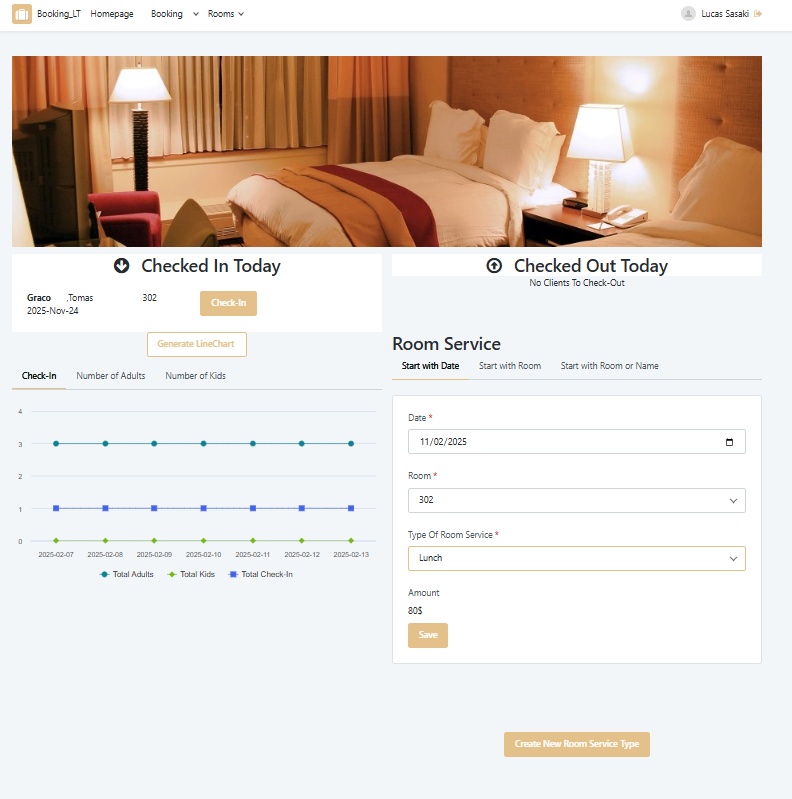
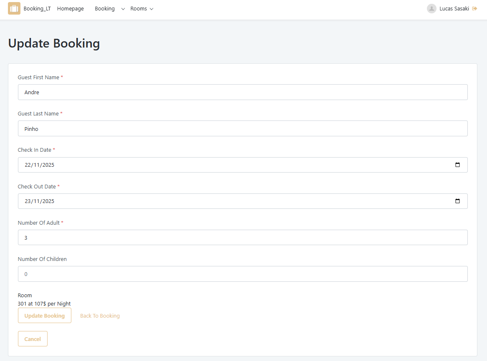
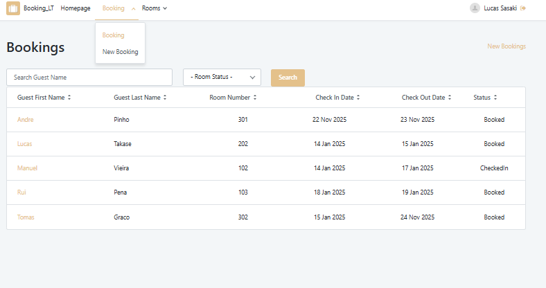
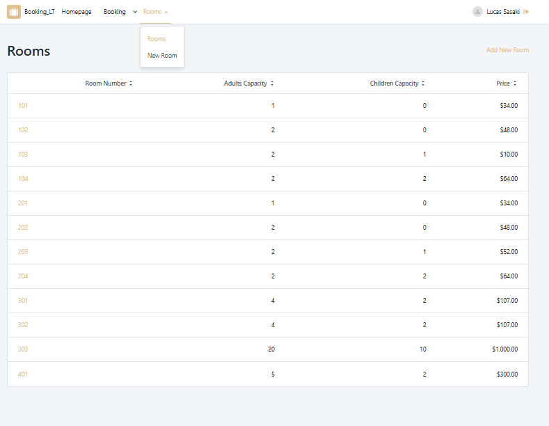
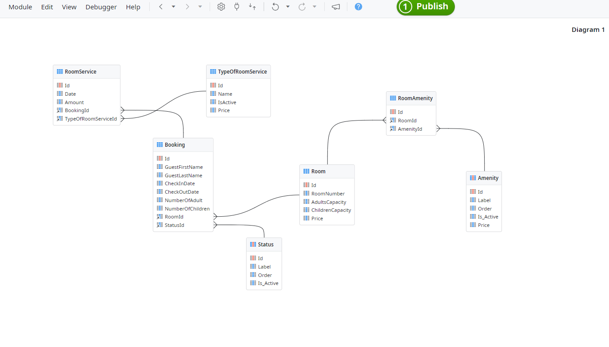

# Hotel Booking Management Project in OutSystems

This project was developed during the second week of an OutSystems lab, conducted by Bool. The primary goal was to learn how to use modules with dependencies in an OutSystems development environment, separating the front-end from the back-end.

## Features

The hotel booking management system offers the following features:

1.  **HomeScreen:**
    *   Graph with the number of adults, children, and check-ins for the current day and the next seven days.
    *   List of check-ins and check-outs for the current day.
    *   Option to request room service.

2.  **Reservation Management:**
    *   List of rooms with reservations.
    *   Ability to change reservation details.
    *   Create new bookings.

3.  **Room Management:**
    *   List of available rooms.
    *   Option to add amenities to rooms.
    *   Option to edit room characteristics.

## Architecture

The project was developed using two main modules:

*   **Front-end Module:** Responsible for the user interface and interaction with the back-end.
*   **Back-end Module:** Responsible for business logic, data access, and management of reservations and rooms.

## Security

All system pages have role verifications to ensure appropriate access to functionalities, including roles for Employee, Anonymous, Registered, and Manager.

## Technologies

*   OutSystems Platform (O11)

## Screenshots/Images

  

    
  

  

    
    
  

   
  

    
    
  

   
 
 

## Notes

This project was developed under the supervision of an OutSystems professor (Paulo Resende) from Bool, over a period of less than 5 days. The main focus was learning the use of modules with dependencies and applying basic concepts of OutSystems development.

## Next Steps

*   Improve the user interface to make it more intuitive and responsive.
*   Implement additional features, such as reports and integration with payment systems.
*   Conduct security and performance tests to ensure the quality of the system.
